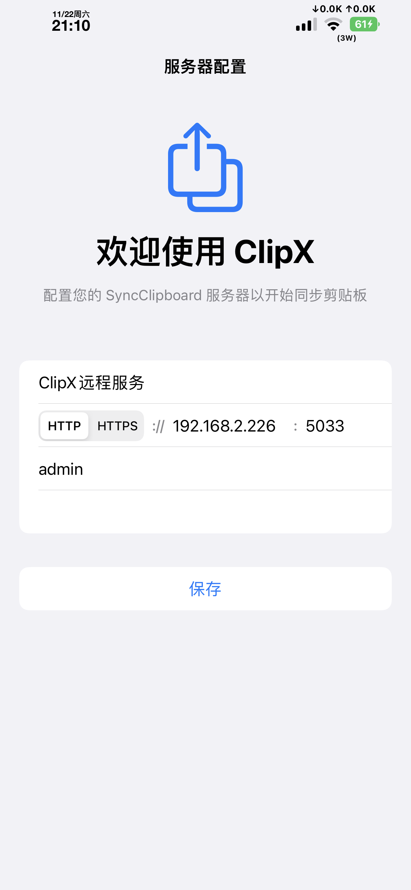
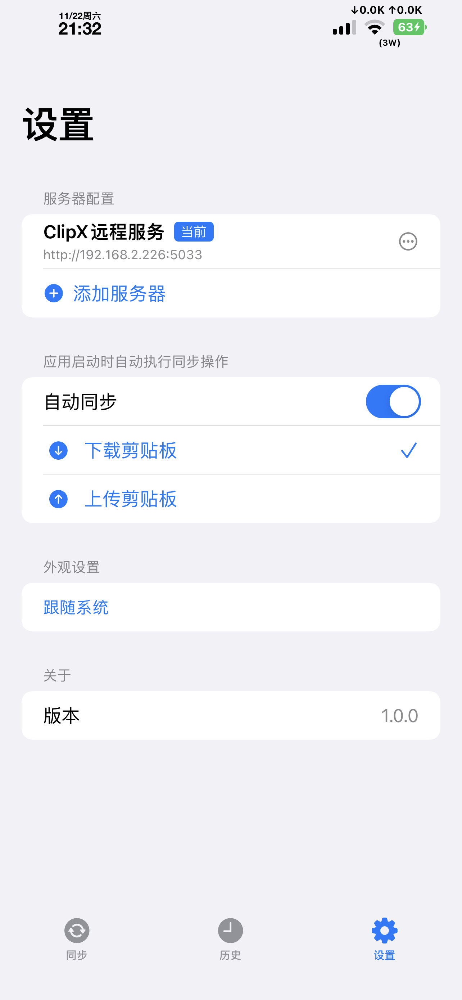
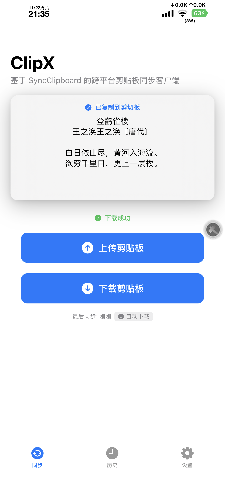
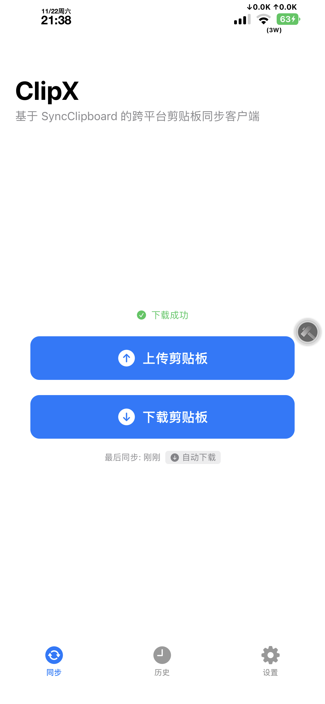
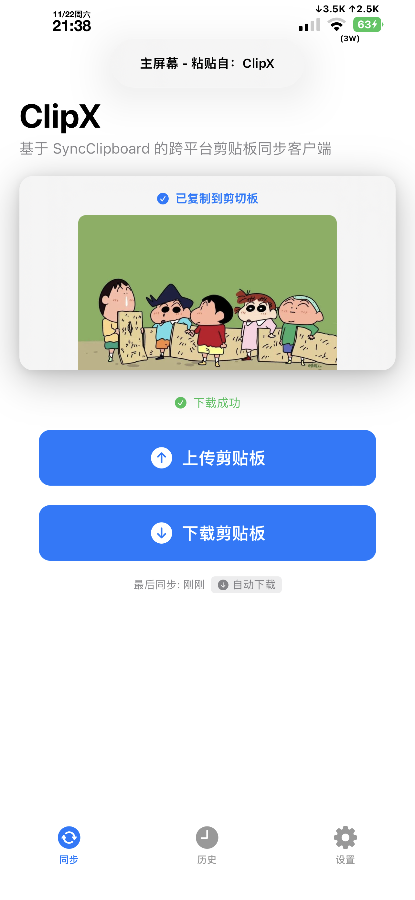
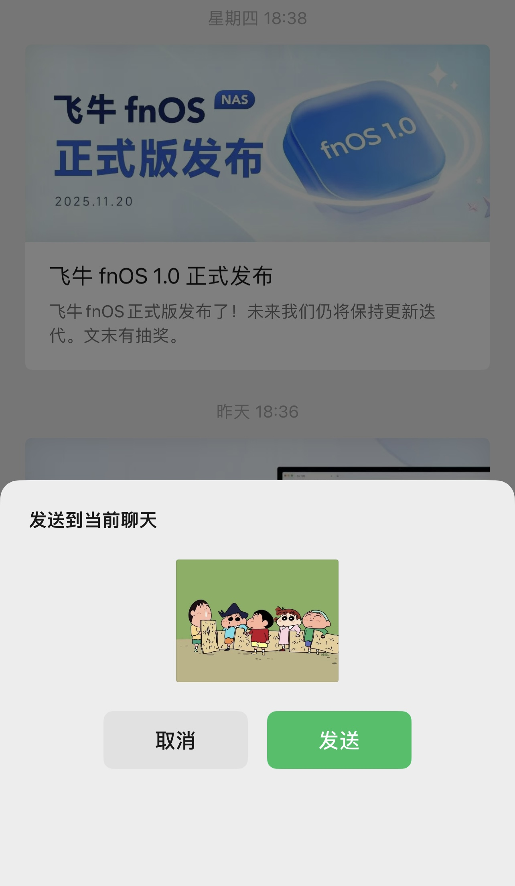
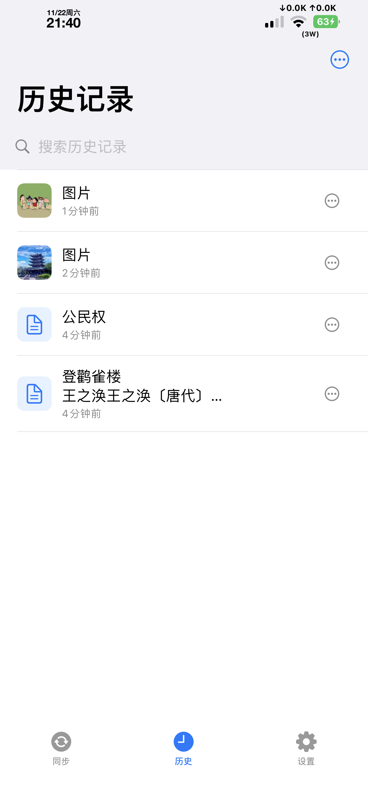
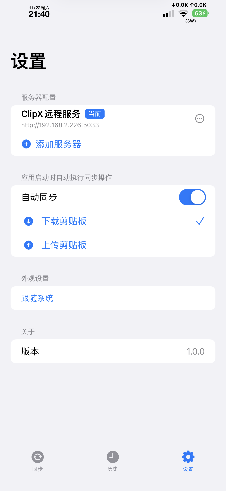

# ClipX

一个基于 SyncClipboard 的iOS剪贴板同步客户端，实现IOS端的剪贴板同步。

## ✨ 特性

- 🔄 **自动同步** - 应用回到前台时自动触发同步（上传或下载），无需手动点击按钮
- 🧠 **智能检测** - 检测剪贴板内容，推断是否想要上传。检测到新内容时延迟下载，给用户上传机会；检测到过期内容时立即下载
- ⚙️ **同步方案切换** - 支持切换自动同步方案（上传/下载），默认自动下载
- 📋 **多类型支持** - 支持文本、图片、文件等剪贴板内容类型
- 🕐 **历史记录** - 记录所有同步的剪贴板内容
- 🔒 **安全存储** - 使用 Keychain 存储服务器密码

## 📸 截图

<table>
  <tr>
    <td width="33.3%">
      
      
引导界面

    </td>
    <td width="33.3%">
      
      
服务器配置

    </td>
    <td width="33.3%">
      
      
主界面 - 同步

    </td>
  </tr>
  <tr>
    <td width="33.3%">
      
      
历史记录

    </td>
    <td width="33.3%">
      
      
设置页面

    </td>
    <td width="33.3%">
      
      
同步状态

    </td>
  </tr>
  <tr>
    <td width="33.3%">
      
      
功能展示

    </td>
    <td width="33.3%">
      
      
功能展示

    </td>
    <td width="33.3%">
      
      
功能展示

    </td>
  </tr>
</table>

### 系统要求

- iOS 15.0+

## 👤 作者

musionx

